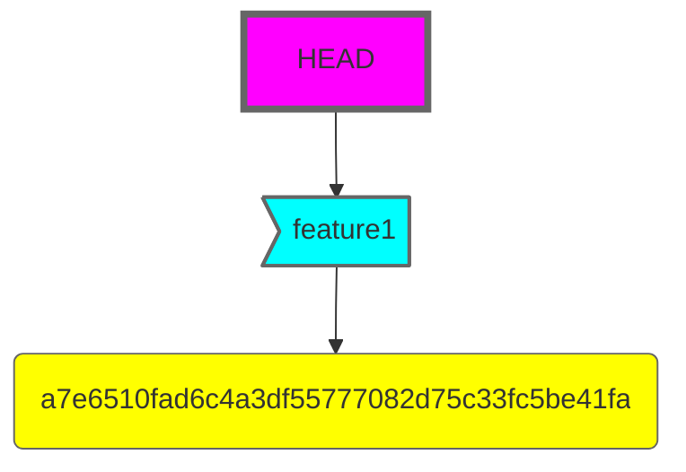
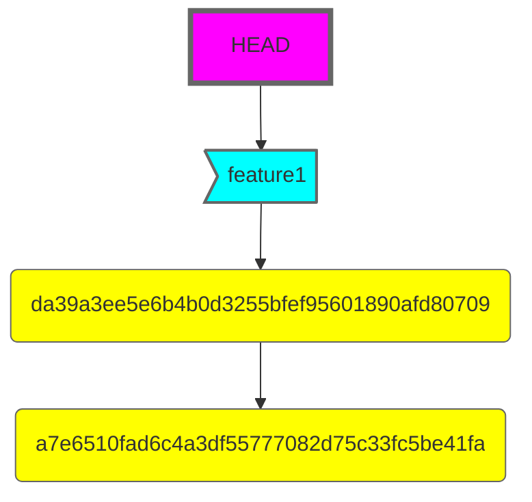
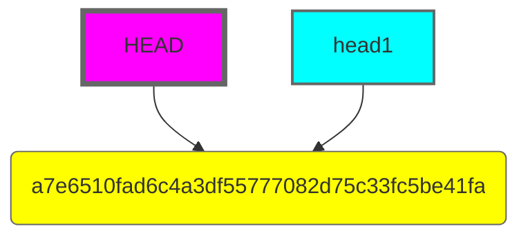
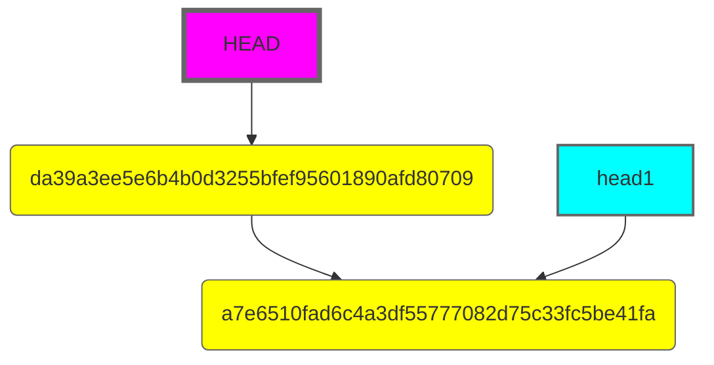

# HEAD

HEAD is a pointer which determines which point of the history the local
file system should reflect. HEAD can point at a commit either directly
or indirectly, through [references](./references.md).
When [commits](./commits.md) are created, the their 
parents are set to whatever HEAD was referencing at the time of their
creation.

---

---

---

## Detached HEAD

When the HEAD does not point at any of heads, it is in a detached state.
What that means is that when commits being created, they are not
associated with any head. If one switches to another point of history
without creating one (or [tagging](./references/tags.md) it), 
these commits will not be addressable in any other way than by their 
40-digit long hash. Additionally, due to git clients optimisation, they
may be subject for garbage collecting and disappear completely at some
point of time.

---

---

---
