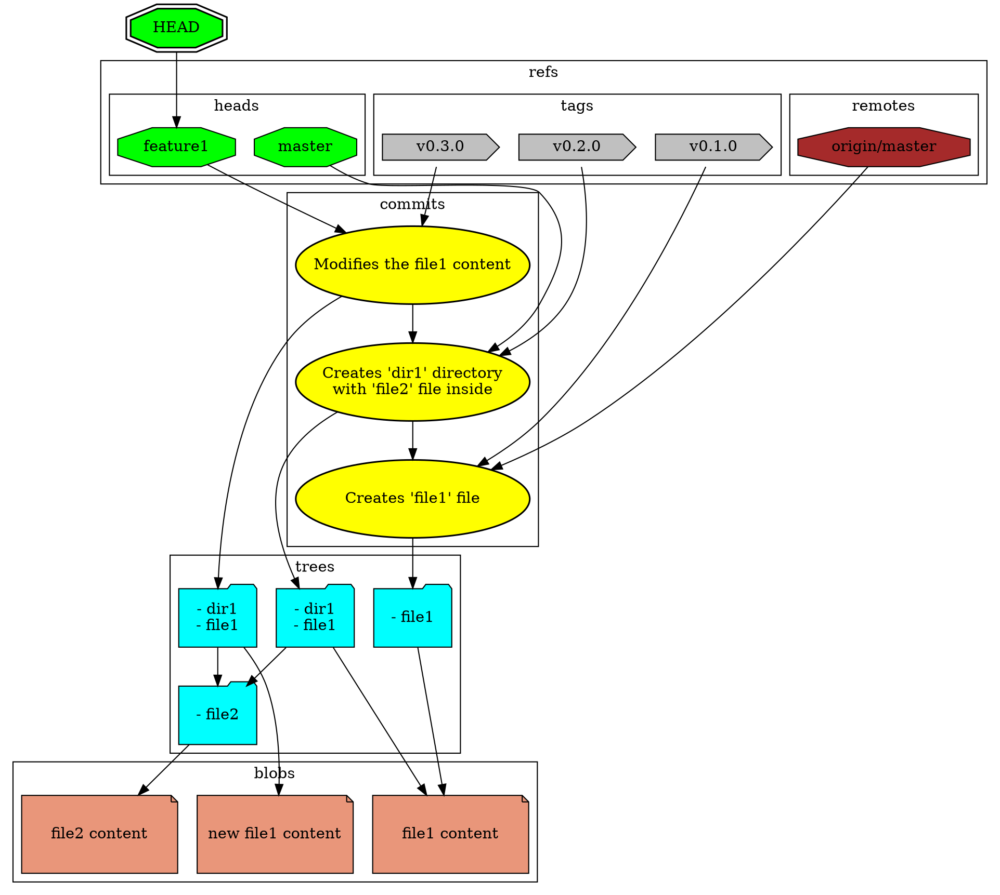

# Overview

```dot process Graph 1
digraph {

  {
    node [ style=filled color=black ]
    HEAD [ fillcolor=lime shape=doubleoctagon penwidth=1.5 ]

    {
      node [ fillcolor=darksalmon shape=note height=1 width=2 ]
      b1 [ label="file1 content" ]
      b2 [ label="file2 content" ]
      b3 [ label="new file1 content" ]
    }

    {
      node [ fillcolor=yellow shape=oval penwidth=1.5 height=1 width=3 ]
      c1 [ label="Creates 'file1' file" ]
      c2 [ label="Creates 'dir1' directory\nwith 'file2' file inside" ]
      c3 [ label="Modifies the file1 content" ]
    }

    {
      node [ fillcolor=green shape=octagon]
      feature1, master
    }

    {
      node [ fillcolor=brown shape=octagon ]
      origin_master [ label="origin/master" ]
    }

    {
      node [ fillcolor=aqua shape=folder height=0.75 width=1 ]
      t1 [ label="- file1" ]
      t2 [ label="- dir1\n- file1" ]
      t3 [ label="- file2"]
      t4 [ label="- dir1\n- file1" ]
    }

    {
      node [ fillcolor=grey shape=cds height=0.5 width=1.5 ]
      v1 [ label="v0.1.0" ]
      v2 [ label="v0.2.0" ]
      v3 [ label="v0.3.0" ]
    }

  }

  subgraph cluster_commits {
    label="commits"
    c3 -> c2 -> c1
  }

  subgraph cluster_refs {
    label="refs"

    subgraph cluster_heads {
      label="heads"
      feature1 -> c3
      master -> c2
    }

    subgraph cluster_tags {
      label="tags"
      v1 -> c1
      v2 -> c2
      v3 -> c3
    }

    subgraph cluster_remotes {
      label="remotes"
      origin_master -> c1
    }
  }

  subgraph cluster_trees {
    label="trees"
    c1 -> t1
    c2 -> t2
    t2 -> t3
    c3 -> t4
    t4 -> t3
  }

  subgraph cluster_blobs {
    label="blobs"
    t1 -> b1
    t2 -> b1
    t3 -> b2
    t4 -> b3
  }

  HEAD -> feature1
}
```
